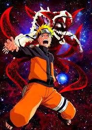

# Naruto

    
    
    

## Introduction
1. **Character Chatbot (LLM3)**: This project involves developing a chatbot using the LLaMA3 model, which is fine-tuned to simulate conversations with various characters from the Naruto series. It leverages advanced natural language processing techniques to provide engaging and contextually relevant responses.

2. **Character Network Space Pre-trained**: This project focuses on creating a pre-trained model that maps characters from the Naruto series into a network space. The model captures relationships and interactions between characters, enabling analysis and visualization of character networks.

3. **Text Classification LLM**: This project utilizes a large language model (LLM) for text classification tasks. It is designed to classify text data into predefined categories, leveraging the power of LLMs to achieve high accuracy and performance in various text classification applications.

4. **Theme Classifier**: This project involves building a theme classifier using the BART-large-MNLI model. It classifies themes in scripts or text data, identifying and categorizing different themes present in the content, which is particularly useful for analyzing narrative structures in the Naruto series.

## Datasets
1:   [Naruto Fandom Wiki](https://subtitlist.com/subs/naruto-season-1/english/2206507)
Naruto Fandom Wiki: This dataset contains subtitles from the first season of Naruto, providing a comprehensive collection of dialogues and interactions between characters. It is useful for training language models and chatbots. 

2:   [transcript](https://www.kaggle.com/datasets/leonzatrax/naruto-ep-1-transcript)
 This dataset includes the transcript of the first episode of Naruto, offering detailed text data for analysis and model training. It is ideal for text classification and theme identification tasks

3:   [Jutso](https://naruto.fandom.com/wiki/Special:BrowseData/Jutsu?limit=250&offset=0&_cat=Jutsu)
This dataset from the Naruto Fandom Wiki lists various Jutsu techniques used in the series, along with their descriptions and attributes. It is valuable for creating models that understand and classify different Jutsu techniques.
## Demo
## Video
<video width="600" controls>
  <source src="assets/naruto_shebdon.mov" type="video/mp4">
  Your browser does not support the video tag.
</video>

