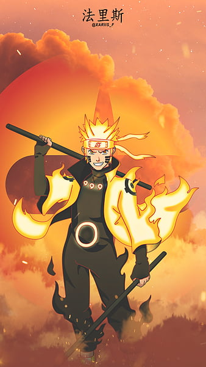

# Naruto

    
    
    

## Introduction
1. **Character Chatbot (LLM3)**: This project involves developing a chatbot using the LLaMA3 model, which is fine-tuned to simulate conversations with various characters from the Naruto series. It leverages advanced natural language processing techniques to provide engaging and contextually relevant responses.

2. **Character Network Space Pre-trained**: This project focuses on creating a pre-trained model that maps characters from the Naruto series into a network space. The model captures relationships and interactions between characters, enabling analysis and visualization of character networks.

3. **Text Classification LLM**: This project utilizes a large language model (LLM) for text classification tasks. It is designed to classify text data into predefined categories, leveraging the power of LLMs to achieve high accuracy and performance in various text classification applications.

4. **Theme Classifier**: This project involves building a theme classifier using the BART-large-MNLI model. It classifies themes in scripts or text data, identifying and categorizing different themes present in the content, which is particularly useful for analyzing narrative structures in the Naruto series.

